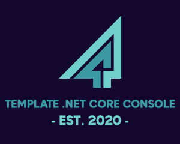

[](https://github.com/rolfwessels/template-dotnet-core-console-app/releases)
[](https://hub.docker.com/r/rolfwessels/template-dotnet-core-console-app/tags)
[](https://hub.docker.com/r/rolfwessels/template-dotnet-core-console-app/tags)
[](https://github.com/rolfwessels/template-dotnet-core-console-app/licence.md)




# 🌐 Template template dotnet core console app

This makes template dotnet core console app happen

## 🚀 Getting started

This project comes with a development container will all the tooling required to build publish and deploy a project. Simply run the following commands to start development in the container.

```bash
# bring up dev environment
make build up
# test the project
make test
# run default package
make start
# build the project ready for publish
make publish
```

To deploy a docker image you can use the following commands

```bash
# log into docker
make docker-build docker-login docker-push 
# or just
make docker-publish
# to make an additional release of the docker image for this branch
make  docker-pull-short-tag docker-tag-env env=latest
# to update the deployment call
make deploy env=dev
```
## 🛠 Prerequisites

Before you begin, ensure you have met the following requirements:
- Docker installed on your machine. See [Docker installation guide](https://docs.docker.com/get-docker/).
- Git, for version control. [Install Git](https://git-scm.com/downloads).
- Ability to run make file, eg. `wsl` 

## 📋 Available make commands

### 💻 Commands outside the container

- `make up` : brings up the container & attach to the default container
- `make down` : stops the container
- `make build` : builds the container

### 🐳 Commands to run inside the container

- `start` : Run the Template template dotnet core console app
- `test` : Test the Template template dotnet core console app
- `publish` : Publish the Template template dotnet core console app
- `docker-login` : Login to docker registry
- `docker-build` : Build the docker image
- `docker-push` : Push the docker image
- `docker-pull-short-tag` : Pull the docker image based in git short hash
- `docker-tag-env` : Tag the docker image based in the environment
- `docker-publish` : Publish the docker image
- `deploy` : Deploy the Template template dotnet core console app
- `update-packages` : Update the packages`

## 💻 Development

### ➕ Add a project

```
dotnet new classlib -n ProveIngestion.Api.Common -o ./src/ProveIngestion.Api.Common
dotnet new nunit -n ProveIngestion.Api.Common.Tests -o ./tests/ProveIngestion.Api.Common.Tests
dotnet sln  ProveIngestion.Cmd.sln add ./src/ProveIngestion.Api.Common/ProveIngestion.Api.Common.csproj
dotnet sln  ProveIngestion.Cmd.sln add ./tests/ProveIngestion.Api.Common.Tests/ProveIngestion.Api.Common.Tests.csproj
dotnet sln  ProveIngestion.Cmd.sln list
```

### 🔄 Versioning

Semantic Versioning (SemVer) is a versioning scheme for software that conveys meaning about the underlying changes. It's composed of three segments:

1. **Major** version (`MAJOR`): Incremented for incompatible API changes.
2. **Minor** version (`MINOR`): Incremented for backward-compatible functionality additions.
3. **Patch** version (`PATCH`): Incremented for backward-compatible bug fixes.

Updating version numbers:

- Manual updates to `MAJOR` and `MINOR` versions using a `versionPrefix` variable in the makefile.
- Automatic determination of `PATCH` levels based on commit messages in the `main` branch.
- Addition of pre-release identifiers for non-main branches, derived from the commit delta between feature branches and the main branch.

To test what the current version is just call

```bash
make version
```

## 🔄 Development Workflow

Our project adheres to a modified version of the [Git Flow](https://nvie.com/posts/a-successful-git-branching-model/) workflow, tailored to streamline our release process.

### Feature/Bug Branches

- **Creation**: Developers create feature branches off the `main` branch for new features or bug fixes.
- **Naming Convention**: Feature branches are named with the prefix `feature/` followed by a descriptive name (e.g., `feature/add-login`).
- **Bug fixes**: Branches are named with the prefix `bug/` followed by a descriptive name (e.g., `bug/fix-login-button`).

### Main Branch

- The `main` branch holds the production-ready code.
- Changes from `feature` are merged into `main` when they are complete
- The build pipeline will deploy from `main` to development environments as required

### Releases

- **Tagging**: Instead of creating a release branch, we use tags to mark a new release.
- **Process**:
  1. When we're ready to release, we ensure that `main` is stable and all desired changes for the release have been merged.
  2. We then create a tag from the `main` branch with the version number, following [Semantic Versioning](https://semver.org/) (e.g., `v1.2.0`).
  4. The tagged commit in the `main` branch is considered the official release of that version.

### Hotfixes

- Hotfixes are created off the `v1.xxx` tag if urgent fixes are needed in production.
- Once completed, hotfixes are merged back into both `main`, and a new tag is created to mark the hotfix release (e.g., `v1.2.1`).

## FAQ

**Question**: Can I use this application on Windows or Linux?

**Answer**: Yes, the application is cross-platform and can be run on Linux, macOS, and Windows.

**Question**: How do I update to the latest version?

**Answer**: Pull the latest changes from the repository and rebuild your Docker container.

## Research

- <https://opensource.com/article/18/8/what-how-makefile> What is a Makefile and how does it work?
